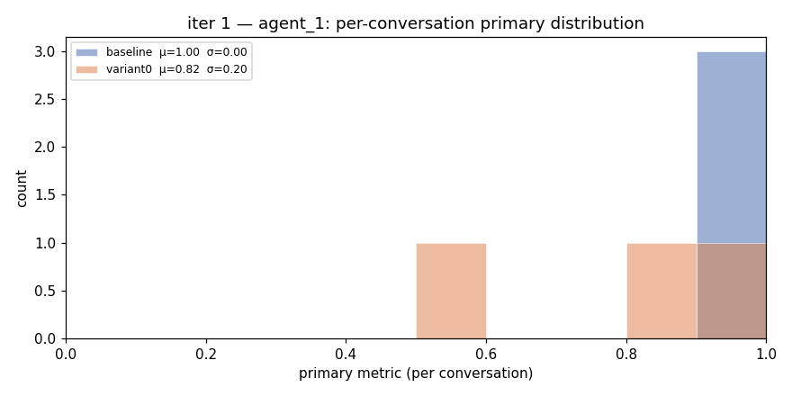
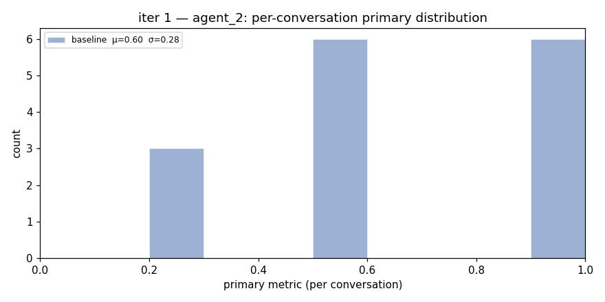
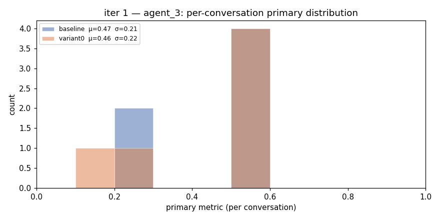
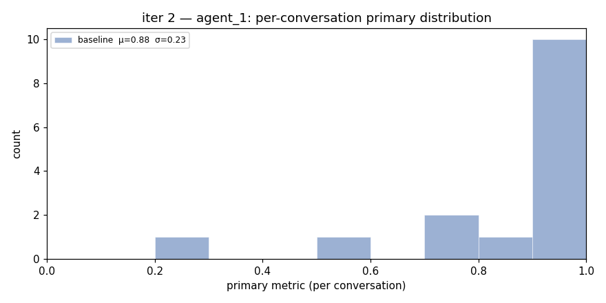
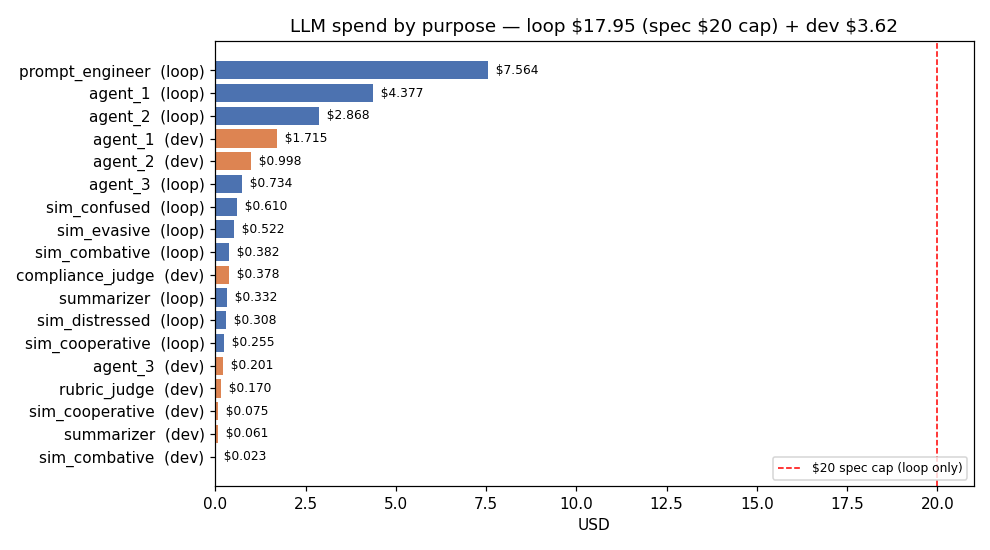

# Evolution Report

_Auto-generated from `prompt_versions`, `meta_eval_findings`, `cost_ledger`, and `data/raw_evaluations/iter_*.csv`._

## Headline numbers

| | |
|---|---|
| **Learning-loop LLM spend** (the $20 metric) | **$17.9533** of $20  ✓ |
| Development / smoke / chat / probe spend (separate) | $3.6223 |
| Total LLM calls | 5,703 (4,268 loop + 1,435 dev) |
| Iterations on record (CSV) | 2 |
| Distinct agents touched | 3 |
| Prompt-version rows logged | 47 |
| Meta-eval findings | 9 (2 applied) |

## Meta-evaluation (Darwin-Gödel)

Auto-applied corrections to the evaluator itself:

- **id=4** type=`lenient_compliance_judge` applied=2026-05-13 04:45:21
  - Audited 8 distressed-persona conversations. 4 cases (50%) where v0001 rated compliance_score>=3 but strict per-rule judge found rule_5_hardship_handled = FAIL.
  - false negatives: **4** out of 8
  - fix: Replace rubric judge v0001 (vague single compliance_score 1-5) with v0002 (per-rule pass/fail checklist for all 8 rules). Re-evaluate historical decisions under v0002.

- **id=7** type=`lenient_compliance_judge` applied=2026-05-14 17:26:56
  - Audited 8 distressed-persona conversations. 4 cases (50%) where v0001 rated compliance_score>=3 but strict per-rule judge found rule_5_hardship_handled = FAIL.
  - false negatives: **4** out of 8
  - fix: Replace rubric judge v0001 (vague single compliance_score 1-5) with v0002 (per-rule pass/fail checklist for all 8 rules). Re-evaluate historical decisions under v0002.

All findings (low + medium + high):

| id | type | applied | description |
|---|---|---|---|
| 1 | `lenient_compliance_judge` |  | Audited 1 distressed-persona conversations. 0 cases (0%) where v0001 rated compl… |
| 2 | `metric_outcome_correlation` |  | Outcome distribution over last 77 learning-loop conversations: {'assessed': 36, … |
| 3 | `inter_judge_agreement` |  | Cohen's kappa between v0001 (binary 'compliance_score>=3') and strict rule_5 jud… |
| 4 | `lenient_compliance_judge` | ✓ | Audited 8 distressed-persona conversations. 4 cases (50%) where v0001 rated comp… |
| 5 | `metric_outcome_correlation` |  | Outcome distribution over last 77 learning-loop conversations: {'assessed': 36, … |
| 6 | `inter_judge_agreement` |  | Cohen's kappa between v0001 (binary 'compliance_score>=3') and strict rule_5 jud… |
| 7 | `lenient_compliance_judge` | ✓ | Audited 8 distressed-persona conversations. 4 cases (50%) where v0001 rated comp… |
| 8 | `metric_outcome_correlation` |  | Outcome distribution over last 112 learning-loop conversations: {None: 1, 'opt_o… |
| 9 | `inter_judge_agreement` |  | Cohen's kappa between v0001 (binary 'compliance_score>=3') and strict rule_5 jud… |

## Per-agent prompt-version history

### `agent_1`

| id | version | status | tokens | created | adoption evidence |
|---|---|---|---|---|---|
| 1 | v1 | active | 936 | 2026-05-11 19:07:22 |  |
| 10 | v17669 | candidate_preflight | 117 | 2026-05-13 01:57:49 |  |
| 11 | v18787 | candidate_preflight | 977 | 2026-05-13 02:16:27 |  |
| 12 | v10100 | rejected | 998 | 2026-05-13 02:19:47 | diff=**-0.178**, d=-1.23, CI=[-0.400, +0.000] |
| 13 | v19542 | candidate_preflight | 1001 | 2026-05-13 02:29:02 |  |
| 14 | v10035 | candidate_preflight | 980 | 2026-05-13 02:37:15 |  |
| 15 | v10200 | rejected | 980 | 2026-05-13 02:46:07 | diff=**+0.094**, d=0.33, CI=[-0.018, +0.230] |
| 19 | v18987 | candidate_preflight | 1112 | 2026-05-14 17:13:07 |  |
| 20 | v19341 | candidate_preflight | 1300 | 2026-05-14 17:19:01 |  |
| 21 | v19444 | candidate_preflight | 1045 | 2026-05-14 17:20:44 |  |
| 34 | v17907 | candidate_preflight | 1165 | 2026-05-14 19:41:47 |  |
| 35 | v17943 | candidate_preflight | 1173 | 2026-05-14 19:42:23 |  |
| 36 | v19718 | candidate_preflight | 1049 | 2026-05-14 20:11:58 |  |
| 37 | v19752 | candidate_preflight | 1151 | 2026-05-14 20:12:32 |  |
| 38 | v19941 | candidate_preflight | 1134 | 2026-05-14 20:15:41 |  |
| 39 | v19978 | candidate_preflight | 1080 | 2026-05-14 20:16:18 |  |
| 40 | v11074 | candidate_preflight | 1270 | 2026-05-14 20:34:34 |  |
| 41 | v11103 | candidate_preflight | 1237 | 2026-05-14 20:35:03 |  |
| 42 | v12744 | candidate_preflight | 1048 | 2026-05-14 21:02:24 |  |
| 43 | v13049 | candidate_preflight | 1191 | 2026-05-14 21:07:29 |  |
| 44 | v10101 | rejected | 1191 | 2026-05-14 21:14:20 | diff=**+0.000**, d=0.00, CI=[-0.160, +0.160] |
| 45 | v13460 | candidate_preflight | 1096 | 2026-05-14 21:14:20 |  |
| 46 | v13493 | candidate_preflight | 1094 | 2026-05-14 21:14:53 |  |
| 47 | v14019 | candidate_preflight | 998 | 2026-05-14 21:23:39 |  |

### `agent_2`

| id | version | status | tokens | created | adoption evidence |
|---|---|---|---|---|---|
| 2 | v1 | active | 866 | 2026-05-11 19:07:22 |  |
| 22 | v10094 | candidate_preflight | 1147 | 2026-05-14 17:31:34 |  |
| 23 | v10226 | candidate_preflight | 1094 | 2026-05-14 17:33:46 |  |
| 24 | v10276 | candidate_preflight | 1140 | 2026-05-14 17:34:36 |  |
| 25 | v10102 | rejected | 1140 | 2026-05-14 17:38:02 | diff=**+0.031**, d=0.11, CI=[-0.069, +0.100] |
| 26 | v12748 | candidate_preflight | 1120 | 2026-05-14 18:15:48 |  |
| 27 | v12798 | candidate_preflight | 1061 | 2026-05-14 18:16:38 |  |
| 28 | v12847 | candidate_preflight | 1044 | 2026-05-14 18:17:27 |  |
| 29 | v12916 | candidate_preflight | 1153 | 2026-05-14 18:18:36 |  |
| 30 | v13151 | candidate_preflight | 1182 | 2026-05-14 18:22:31 |  |
| 31 | v13210 | candidate_preflight | 1190 | 2026-05-14 18:23:30 |  |
| 32 | v10101 | rejected | 1190 | 2026-05-14 18:30:52 | diff=**+0.087**, d=0.32, CI=[+0.000, +0.180] |
| 33 | v13652 | candidate_preflight | 1233 | 2026-05-14 18:30:52 |  |

### `agent_3`

| id | version | status | tokens | created | adoption evidence |
|---|---|---|---|---|---|
| 3 | v1 | active | 711 | 2026-05-11 19:07:22 |  |
| 17 | v11496 | candidate_preflight | 835 | 2026-05-13 19:41:36 |  |
| 18 | v10100 | rejected | 835 | 2026-05-13 19:44:52 | diff=**-0.008**, d=-0.04, CI=[-0.225, +0.200] |

### `judge`

| id | version | status | tokens | created | adoption evidence |
|---|---|---|---|---|---|
| 4 | v1 | retired_by_meta_eval | 397 | 2026-05-11 19:07:22 |  |
| 16 | v2 | active | 754 | 2026-05-13 04:45:21 | promoted by **meta_evaluator** — meta-eval compliance audit detected lenient v0001 judge missing rule_5 violation |

### `sim_combative`

| id | version | status | tokens | created | adoption evidence |
|---|---|---|---|---|---|
| 6 | v1 | active | 367 | 2026-05-11 19:33:48 |  |

### `sim_confused`

| id | version | status | tokens | created | adoption evidence |
|---|---|---|---|---|---|
| 8 | v1 | active | 420 | 2026-05-11 19:33:48 |  |

### `sim_cooperative`

| id | version | status | tokens | created | adoption evidence |
|---|---|---|---|---|---|
| 5 | v1 | active | 328 | 2026-05-11 19:07:22 |  |

### `sim_distressed`

| id | version | status | tokens | created | adoption evidence |
|---|---|---|---|---|---|
| 9 | v1 | active | 460 | 2026-05-11 19:33:48 |  |

### `sim_evasive`

| id | version | status | tokens | created | adoption evidence |
|---|---|---|---|---|---|
| 7 | v1 | active | 419 | 2026-05-11 19:33:48 |  |

## Per-iteration evaluations (raw + multi-method consensus)

Every (baseline, variant) pair from `data/raw_evaluations/iter_*.csv` is re-evaluated retroactively under SIX independent statistical methods:

- Paired bootstrap CI (the original gate)
- Paired t-test (parametric)
- Wilcoxon signed-rank (non-parametric)
- Sign-flipping permutation test
- Cohen's d / Hedges' g / Cliff's delta (effect-size triple)

Adoption decision under each method is shown so a reader can see where the methods agree and where they diverge.

### iteration 1 — `agent_1`



**baseline** (N=3): μ=**1.000**  σ=0.000  median=1.000  IQR=[1.000, 1.000]

Per-persona means: `combative` μ=1.000 (n=1), `cooperative` μ=1.000 (n=1), `evasive` μ=1.000 (n=1)

| variant | mean Δ | Cohen's d | Hedges' g | Cliff's δ | t-test p | Wilcoxon p | permutation p | bootstrap CI | adopt? |
|---|---|---|---|---|---|---|---|---|---|
| variant0 | **-0.178** | -1.23 (large) | -1.23 (large) | -0.67 (large) | 0.865 | 1.000 | 1.000 | [-0.400, +0.000] | no |

<details><summary>per-conversation scores</summary>


| borrower | persona | baseline | variant0 |
|---|---|---|---|
| #0 | cooperative | 1.000 | 1.000 |
| #1 | combative | 1.000 | 0.600 |
| #2 | evasive | 1.000 | 0.867 |

</details>

### iteration 1 — `agent_2`



**baseline** (N=15): μ=**0.600**  σ=0.278  median=0.500  IQR=[0.500, 0.900]

Per-persona means: `combative` μ=0.200 (n=3), `confused` μ=0.633 (n=3), `cooperative` μ=0.900 (n=3), `distressed` μ=0.767 (n=3), `evasive` μ=0.500 (n=3)

_No variants were evaluated this iteration._

### iteration 1 — `agent_3`



**baseline** (N=6): μ=**0.467**  σ=0.207  median=0.600  IQR=[0.300, 0.600]

Per-persona means: `combative` μ=0.600 (n=1), `confused` μ=0.200 (n=1), `cooperative` μ=0.600 (n=2), `distressed` μ=0.200 (n=1), `evasive` μ=0.600 (n=1)

| variant | mean Δ | Cohen's d | Hedges' g | Cliff's δ | t-test p | Wilcoxon p | permutation p | bootstrap CI | adopt? |
|---|---|---|---|---|---|---|---|---|---|
| variant0 | **-0.008** | -0.04 (negligible) | -0.04 (negligible) | -0.06 (negligible) | 0.529 | 0.750 | 0.754 | [-0.225, +0.200] | no |

<details><summary>per-conversation scores</summary>


| borrower | persona | baseline | variant0 |
|---|---|---|---|
| #0 | cooperative | 0.600 | 0.600 |
| #1 | combative | 0.600 | 0.150 |
| #2 | evasive | 0.600 | 0.600 |
| #3 | confused | 0.200 | 0.600 |
| #4 | distressed | 0.200 | 0.200 |
| #5 | cooperative | 0.600 | 0.600 |

</details>

### iteration 2 — `agent_1`



**baseline** (N=15): μ=**0.876**  σ=0.228  median=1.000  IQR=[0.800, 1.000]

Per-persona means: `combative` μ=0.511 (n=3), `confused` μ=1.000 (n=3), `cooperative` μ=1.000 (n=3), `distressed` μ=1.000 (n=3), `evasive` μ=0.867 (n=3)

_No variants were evaluated this iteration._

## Sensitivity analysis — would adoption change under different N or thresholds?

For every (baseline, variant) pair we sub-sample to N ∈ {10, 15, 20, all} and 
recompute the bootstrap CI lower bound + Cohen's d. Where adoption flips, the cell 
is bolded.

| iter | agent | variant | N=10 ci_lo | N=15 ci_lo | N=20 ci_lo | N=all ci_lo | d (all) |
|---|---|---|---|---|---|---|---|
| 1 | agent_3 | variant0 | — | — | — | -0.225 | -0.04 |

## Cost report



**Learning-loop spend** (the spec's $20 metric — calls tagged with `iteration_id`):

| purpose | calls | input_tok | output_tok | USD |
|---|---|---|---|---|
| `prompt_engineer` | 36 | 152,015 | 67,975 | $7.5640 |
| `agent_1` | 1,556 | 3,710,638 | 133,326 | $4.3773 |
| `agent_2` | 850 | 2,278,496 | 117,973 | $2.8684 |
| `agent_3` | 210 | 547,930 | 37,259 | $0.7342 |
| `sim_confused` | 368 | 400,148 | 42,060 | $0.6104 |
| `sim_evasive` | 400 | 372,403 | 29,985 | $0.5223 |
| `sim_combative` | 240 | 249,570 | 26,426 | $0.3817 |
| `summarizer` | 89 | 136,549 | 39,139 | $0.3322 |
| `sim_distressed` | 183 | 190,383 | 23,519 | $0.3080 |
| `sim_cooperative` | 336 | 205,254 | 9,897 | $0.2547 |
| **LOOP TOTAL** | **4,268** | | | **$17.9533** of $20 |

**Development spend** (not counted against the $20 cap — smoke tests, interactive chat sessions, compliance probes, meta-eval audits):

| purpose | calls | input_tok | output_tok | USD |
|---|---|---|---|---|
| `agent_1` | 697 | 1,485,825 | 45,811 | $1.7149 |
| `agent_2` | 370 | 817,169 | 36,263 | $0.9985 |
| `compliance_judge` | 134 | 81,860 | 7,292 | $0.3777 |
| `agent_3` | 86 | 152,797 | 9,644 | $0.2010 |
| `rubric_judge` | 30 | 29,170 | 3,439 | $0.1703 |
| `sim_cooperative` | 88 | 63,183 | 2,427 | $0.0753 |
| `summarizer` | 19 | 25,201 | 7,199 | $0.0612 |
| `sim_combative` | 11 | 14,188 | 1,842 | $0.0234 |
| **DEV TOTAL** | **1,435** | | | **$3.6223** |

## How to replay this report

```bash
make fresh-start          # postgres + redis + temporal + seed + tests
# (optional) make rerun-eval     re-run the learning loop
# (optional) make meta-eval      re-run the Darwin-Gödel layer
uv run python scripts/build_evolution_report.py
```

Every number above can be regenerated from `data/seeds.json` (RNG seed `20260512`) modulo Anthropic non-determinism. Expected tolerance per spec: ±5 percentage points on primary-metric means, ±0.10 on Cohen's d.
